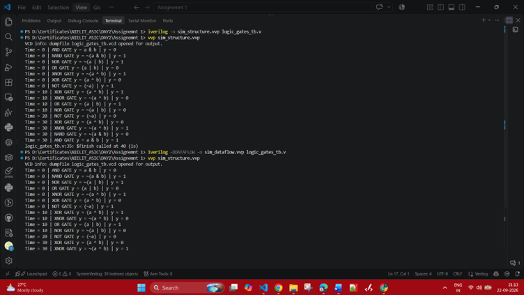
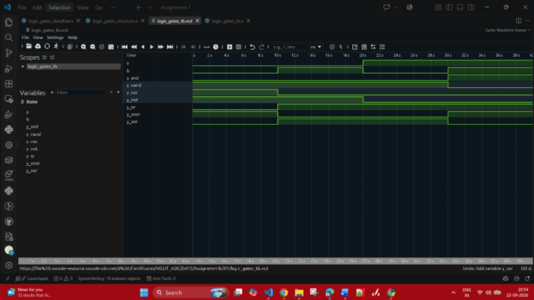
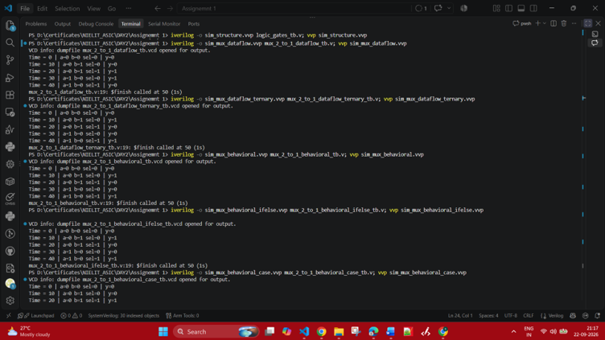
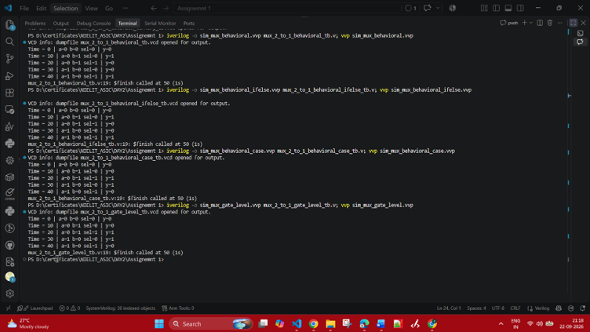
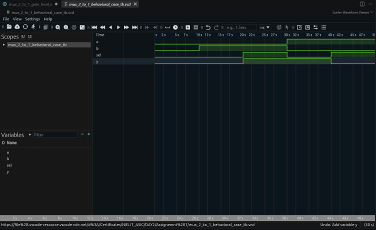

# Assignment 1: Logic Gates and 2:1 Multiplexer

This assignment contains Verilog HDL programs for basic logic gates and a 2:1 multiplexer using different modelling styles. Each design has a corresponding testbench that applies input combinations, prints simulation output, and generates a `.vcd` waveform file for analysis.

## Tools Used

- Verilog HDL
- Icarus Verilog (`iverilog`) for compilation
- `vvp` for simulation
- Surfer / waveform viewer for viewing `.vcd` files
- Visual Studio Code

## Logic Gates Theory

Logic gates are the basic building blocks of digital circuits. They perform Boolean operations on binary inputs and produce binary outputs. This assignment implements the following gates:

| Gate | Boolean Expression | Description |
| --- | --- | --- |
| AND | `y = a & b` | Output is `1` only when both inputs are `1`. |
| NAND | `y = ~(a & b)` | Inverted AND gate. Output is `0` only when both inputs are `1`. |
| OR | `y = a | b` | Output is `1` when at least one input is `1`. |
| NOR | `y = ~(a | b)` | Inverted OR gate. Output is `1` only when both inputs are `0`. |
| NOT | `y = ~a` | Inverts the input signal. |
| XOR | `y = a ^ b` | Output is `1` when the inputs are different. |
| XNOR | `y = ~(a ^ b)` | Output is `1` when the inputs are the same. |

Two modelling styles are used for logic gates:

- **Dataflow modelling:** Uses continuous `assign` statements and Boolean expressions.
- **Structural modelling:** Uses built-in Verilog gate primitives such as `and`, `nand`, `or`, `nor`, `not`, `xor`, and `xnor`.

## 2:1 Multiplexer Theory

A 2:1 multiplexer selects one of two inputs and forwards it to the output based on a select line. It has two data inputs `a` and `b`, one select input `sel`, and one output `y`.

The common expression for a 2:1 MUX is:

```verilog
y = (~sel & a) | (sel & b)
```

In this expression, when `sel = 0`, input `a` is selected. When `sel = 1`, input `b` is selected.

This assignment shows the MUX using gate-level, dataflow, and behavioral modelling. Some files use the convention `sel = 1` selects `a`, while others use `sel = 1` selects `b`; the file descriptions below mention the exact behavior.

## File Details

| File | Description |
| --- | --- |
| `logic_gates_dataflow.v` | Implements AND, NAND, OR, NOR, NOT, XOR, and XNOR gates using dataflow modelling with `assign` statements. |
| `logic_gates_structure.v` | Implements the same basic gates using structural modelling with Verilog primitive gates. |
| `logic_gates_tb.v` | Shared testbench for the logic gate modules. Use `-DDATAFLOW` to test the dataflow file; without it, the structural file is included by default. Generates `logic_gates_tb.vcd`. |
| `mux_2_to_1_gate_level.v` | Gate-level 2:1 MUX using `not`, `and`, and `or` primitives. Implements `y = (~sel & a) | (sel & b)`, so `sel=0` selects `a` and `sel=1` selects `b`. |
| `mux_2_to_1_gate_level_tb.v` | Testbench for the gate-level MUX. Generates `mux_2_to_1_gate_level_tb.vcd`. |
| `mux_2_to_1_dataflow.v` | Dataflow 2:1 MUX using a conditional operator. Implements `y = sel ? b : a`, so `sel=0` selects `a` and `sel=1` selects `b`. |
| `mux_2_to_1_dataflow_tb.v` | Testbench for the dataflow MUX. Generates `mux_2_to_1_dataflow_tb.vcd`. |
| `mux_2_to_1_dataflow_ternary.v` | Dataflow 2:1 MUX using the ternary operator. Implements `y = sel ? a : b`, so `sel=0` selects `b` and `sel=1` selects `a`. |
| `mux_2_to_1_dataflow_ternary_tb.v` | Testbench for the ternary dataflow MUX. Generates `mux_2_to_1_dataflow_ternary_tb.vcd`. |
| `mux_2_to_1_behavioral.v` | Behavioral 2:1 MUX using an `always` block and `if` statement. Implements `sel=0` selects `b` and `sel=1` selects `a`. |
| `mux_2_to_1_behavioral_tb.v` | Testbench for the behavioral MUX. Generates `mux_2_to_1_behavioral_tb.vcd`. |
| `mux_2_to_1_behavioral_ifelse.v` | Behavioral 2:1 MUX using `if-else`. Implements `sel=0` selects `b` and `sel=1` selects `a`. |
| `mux_2_to_1_behavioral_ifelse_tb.v` | Testbench for the behavioral if-else MUX. Generates `mux_2_to_1_behavioral_ifelse_tb.vcd`. |
| `mux_2_to_1_behavioral_case.v` | Behavioral 2:1 MUX using a `case` statement. Implements `sel=0` selects `a` and `sel=1` selects `b`. |
| `mux_2_to_1_behavioral_case_tb.v` | Testbench for the behavioral case-statement MUX. Generates `mux_2_to_1_behavioral_case_tb.vcd`. |

## Compilation and Simulation

Run the commands from this directory:

```powershell
cd "DAY2/Assignemnt 1"
```

### Logic Gates: Structural Modelling

```powershell
iverilog -o sim_structure.vvp logic_gates_tb.v
vvp sim_structure.vvp
```

### Logic Gates: Dataflow Modelling

```powershell
iverilog -DDATAFLOW -o sim_dataflow.vvp logic_gates_tb.v
vvp sim_dataflow.vvp
```

### 2:1 MUX Examples

```powershell
iverilog -o sim_mux_gate_level.vvp mux_2_to_1_gate_level_tb.v
vvp sim_mux_gate_level.vvp

iverilog -o sim_mux_dataflow.vvp mux_2_to_1_dataflow_tb.v
vvp sim_mux_dataflow.vvp

iverilog -o sim_mux_behavioral_case.vvp mux_2_to_1_behavioral_case_tb.v
vvp sim_mux_behavioral_case.vvp
```

## Logic Gates Compilation Output

The compilation and simulation output verifies that the logic gate testbench runs successfully and prints the output values for all input combinations.



## Logic Gates Simulation Waveform

The generated `logic_gates_tb.vcd` file can be opened in a waveform viewer. The waveform shows input signals `a` and `b`, along with the outputs of AND, NAND, OR, NOR, NOT, XOR, and XNOR gates over time.



## Expected Logic Gate Results

| a | b | AND | NAND | OR | NOR | NOT a | XOR | XNOR |
| --- | --- | --- | --- | --- | --- | --- | --- | --- |
| 0 | 0 | 0 | 1 | 0 | 1 | 1 | 0 | 1 |
| 0 | 1 | 0 | 1 | 1 | 0 | 1 | 1 | 0 |
| 1 | 0 | 0 | 1 | 1 | 0 | 0 | 1 | 0 |
| 1 | 1 | 1 | 0 | 1 | 0 | 0 | 0 | 1 |

## 2:1 MUX Truth Table

For the standard expression `y = (~sel & a) | (sel & b)`, the select line chooses the output as shown below.

| sel | Selected Input | y |
| --- | --- | --- |
| 0 | `a` | `a` |
| 1 | `b` | `b` |

Expanded truth table:

| sel | a | b | y |
| --- | --- | --- | --- |
| 0 | 0 | 0 | 0 |
| 0 | 0 | 1 | 0 |
| 0 | 1 | 0 | 1 |
| 0 | 1 | 1 | 1 |
| 1 | 0 | 0 | 0 |
| 1 | 0 | 1 | 1 |
| 1 | 1 | 0 | 0 |
| 1 | 1 | 1 | 1 |

Some MUX files in this assignment use the reverse convention where `sel=0` selects `b` and `sel=1` selects `a`; those file-specific behaviors are listed in the file details table.

## 2:1 MUX Compilation Output

The following screenshots show compilation and simulation output for the 2:1 multiplexer Verilog programs using different modelling styles.





## 2:1 MUX Simulation Waveform

The generated MUX `.vcd` files can be opened in the waveform viewer to verify that the output `y` changes according to input signals `a`, `b`, and select signal `sel`.



## Conclusion

This assignment demonstrates how the same digital circuits can be described using different Verilog modelling styles. Dataflow modelling is useful for direct Boolean expressions, structural modelling shows the circuit in terms of gate interconnections, and behavioral modelling describes the output logic using procedural statements such as `if-else` and `case`.