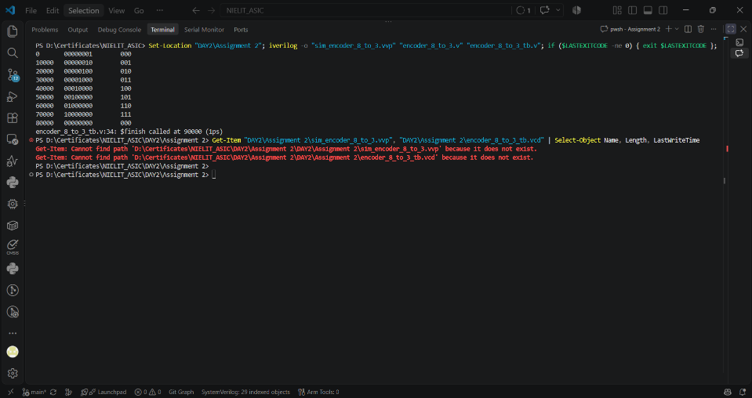
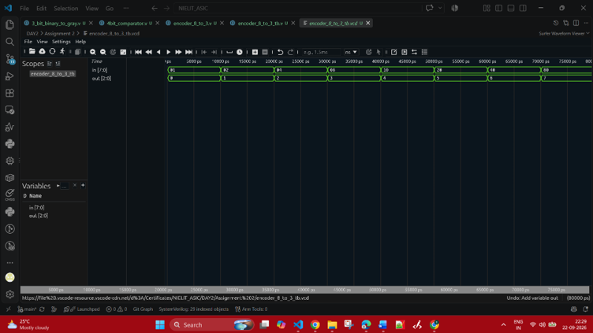

# Assignment 2: Combinational Logic Circuits

This assignment folder contains Verilog HDL files for combinational logic designs. The implemented design is an 8-to-3 encoder with a testbench that drives valid one-hot input combinations, prints simulation output, and generates a `.vcd` waveform file.

## Tools Used

- Verilog HDL
- Icarus Verilog (`iverilog`) for compilation
- `vvp` for simulation
- Waveform viewer for opening `.vcd` files
- Visual Studio Code

## File Details

| File | Description |
| --- | --- |
| `encoder_8_to_3.v` | Implements an 8-to-3 encoder. The input is an 8-bit one-hot signal, and the output is the 3-bit binary code of the active input line. |
| `encoder_8_to_3_tb.v` | Testbench for the encoder. It uses named port mapping while instantiating the design and a `for` loop to drive all 8 valid one-hot input combinations. |
| `encoder_8_to_3_tb.vcd` | Waveform dump generated by the encoder testbench simulation. |
| `sim_encoder_8_to_3.vvp` | Compiled simulation output generated by Icarus Verilog. |
| `3_bit_binary_to_gray.v` | Placeholder file for a 3-bit binary-to-gray converter. The design logic has not been added yet. |
| `4bit_comparator.v` | Placeholder file for a 4-bit comparator. The design logic has not been added yet. |
| `Assignment_Question_02.pdf` | Assignment question/reference document. |
| `Compilation_mux_2_to_1.png` | Compilation screenshot. |
| `Simulation_mux_2_to_1.png` | Simulation screenshot. |

## 8-to-3 Encoder Theory

An encoder is a combinational circuit that converts active input lines into a coded binary output. In an 8-to-3 encoder, there are eight input lines and three output lines. Only one input should be active at a time, and the output represents the binary number corresponding to the active input position.

For example, if input bit `in[5]` is active, the output is `101`, because decimal 5 is represented as binary `101`.

## Encoder Truth Table

| Input `in` | Active Input | Output `out` |
| --- | --- | --- |
| `00000001` | `in[0]` | `000` |
| `00000010` | `in[1]` | `001` |
| `00000100` | `in[2]` | `010` |
| `00001000` | `in[3]` | `011` |
| `00010000` | `in[4]` | `100` |
| `00100000` | `in[5]` | `101` |
| `01000000` | `in[6]` | `110` |
| `10000000` | `in[7]` | `111` |
| Other combinations | Invalid/default case | `000` |

## Testbench Details

The encoder testbench performs the following steps:

- Instantiates `encoder_8_to_3` using named port connections: `.in(in)` and `.out(out)`.
- Uses a `for` loop to generate one-hot inputs from `00000001` to `10000000`.
- Prints one row for each of the 8 input transactions after the combinational output settles.
- Generates `encoder_8_to_3_tb.vcd` using `$dumpfile` and `$dumpvars`.

## Compilation and Simulation

Option 1: run these commands after moving into the Assignment 2 directory:

```powershell
cd "DAY2/Assignment 2"
iverilog -o sim_encoder_8_to_3.vvp encoder_8_to_3.v encoder_8_to_3_tb.v
vvp sim_encoder_8_to_3.vvp
```

Option 2: run these commands directly from the repository root:

```powershell
iverilog -o "DAY2/Assignment 2/sim_encoder_8_to_3.vvp" "DAY2/Assignment 2/encoder_8_to_3.v" "DAY2/Assignment 2/encoder_8_to_3_tb.v"
vvp "DAY2/Assignment 2/sim_encoder_8_to_3.vvp"
```

If the command is run from the repository root without the folder path, Icarus Verilog will show `encoder_8_to_3.v: No such file or directory` because the source files are inside `DAY2/Assignment 2`.

Expected simulation output includes the one-hot encoder cases:

| Input `in` | Output `out` |
| --- | --- |
| `00000001` | `000` |
| `00000010` | `001` |
| `00000100` | `010` |
| `00001000` | `011` |
| `00010000` | `100` |
| `00100000` | `101` |
| `01000000` | `110` |
| `10000000` | `111` |

## Waveform

After running the simulation, open `encoder_8_to_3_tb.vcd` in a waveform viewer. The waveform contains the 8-bit input bus `in` and the 3-bit output bus `out`.

The testbench applies one valid one-hot input every 10 ns, starting with `00000001` and ending with `10000000`. The encoder output changes combinationally to the binary index of the active input bit:

- `in[0]` active produces `out=000`.
- `in[1]` active produces `out=001`.
- `in[2]` active produces `out=010`.
- `in[3]` active produces `out=011`.
- `in[4]` active produces `out=100`.
- `in[5]` active produces `out=101`.
- `in[6]` active produces `out=110`.
- `in[7]` active produces `out=111`.

There is no clock and no intentional propagation delay in the encoder. Any same-timestamp output transition is the normal zero-delay settling of combinational logic. The waveform therefore verifies both the one-hot input sequence and the corresponding encoded output for exactly 8 transactions.

## Simulation Evidence

### Compilation



### Simulation



## Conclusion

This assignment demonstrates the design and verification of an 8-to-3 encoder using Verilog. The encoder uses a `case` statement for combinational logic, while the testbench uses a loop to apply input patterns efficiently and generate waveform output for verification.
