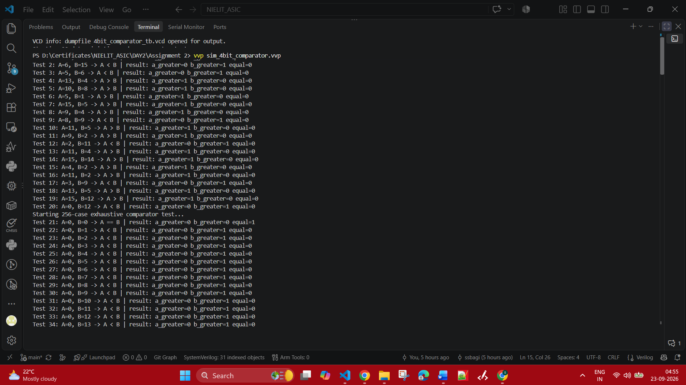
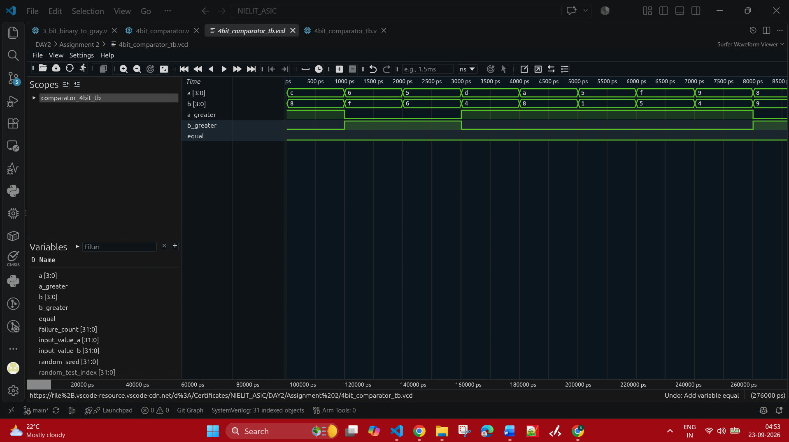
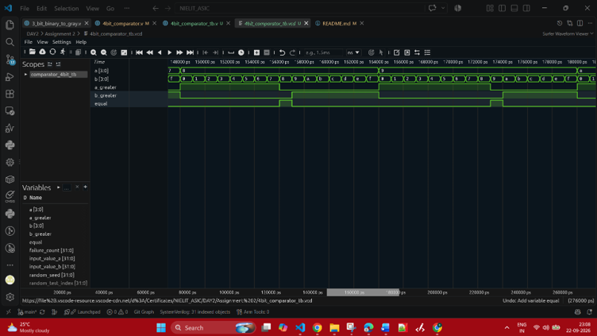
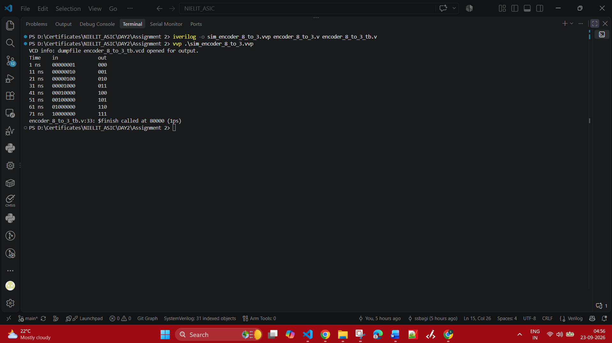
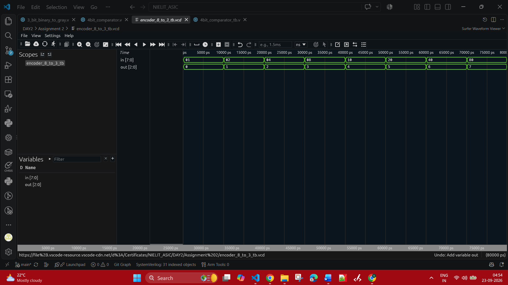
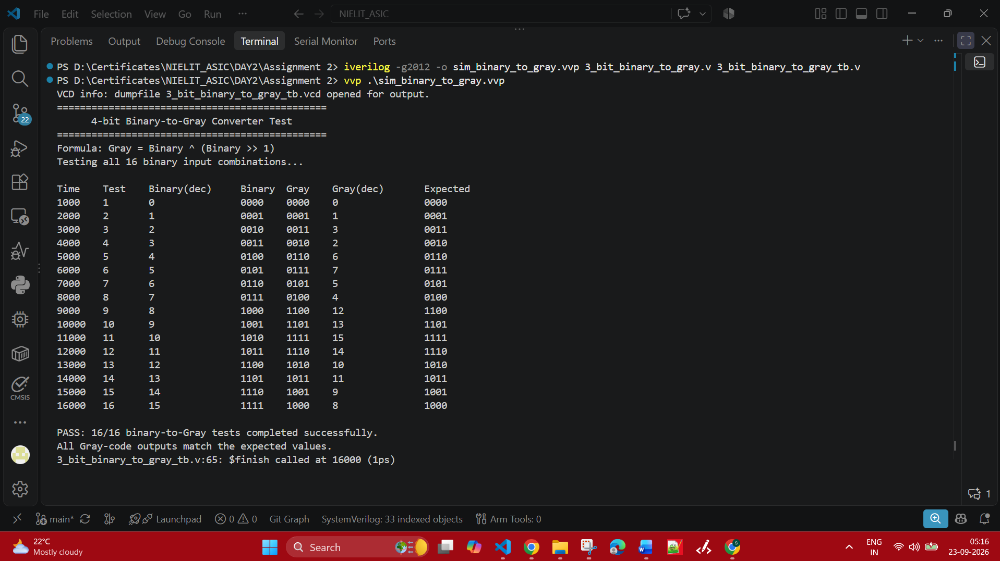
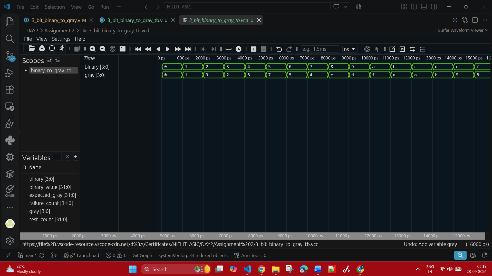

# Assignment 2: Combinational Logic Circuits

This assignment contains three combinational designs: an 8-to-3 encoder, a 4-bit magnitude comparator, and a 4-bit binary-to-Gray converter. Each design has its own RTL source, testbench, simulation output, waveform file, and evidence images.

## Tools Used

- Verilog HDL
- Icarus Verilog (`iverilog`) for compilation
- `vvp` for simulation
- Waveform viewer for opening `.vcd` files
- Visual Studio Code

## Assignment Files

| File | Description |
| --- | --- |
| `encoder_8_to_3.v` | 8-to-3 one-hot encoder using combinational `case` logic. |
| `encoder_8_to_3_tb.v` | Encoder testbench covering all 8 valid one-hot inputs. |
| `encoder_8_to_3_tb.vcd` | Encoder waveform dump. |
| `sim_encoder_8_to_3.vvp` | Compiled encoder simulation. |
| `4bit_comparator.v` | Unsigned 4-bit magnitude comparator. |
| `4bit_comparator_tb.v` | Comparator testbench with random and exhaustive tests. |
| `4bit_comparator_tb.vcd` | Comparator waveform dump. |
| `sim_4bit_comparator.vvp` | Compiled comparator simulation. |
| `3_bit_binary_to_gray.v` | 4-bit binary-to-Gray dataflow converter. |
| `3_bit_binary_to_gray_tb.v` | Gray converter testbench covering all 16 inputs. |
| `3_bit_binary_to_gray_tb.vcd` | Gray converter waveform dump. |
| `sim_binary_to_gray.vvp` | Compiled Gray converter simulation. |
| `Assignment_Question_02.pdf` | Assignment question/reference document. |
| `DAY2_Assignmnet_2_shreyas_s_bagi.pdf` | Assignment 2 submission document. |

## 4-bit Comparator

### Theory

The comparator accepts two unsigned 4-bit values, `a[3:0]` and `b[3:0]`, representing values from `0` to `F`. It compares the inputs from the most significant bit to the least significant bit. The first bit position where the inputs differ determines the result. If all four bit pairs match, the values are equal.

The outputs are mutually exclusive:

| Output | Meaning |
| --- | --- |
| `a_greater` | `A > B` |
| `b_greater` | `A < B` |
| `equal` | `A == B` |

### Testbench and Verification

The comparator testbench first runs 20 deterministic random tests and then checks all 256 possible pairs of 4-bit values. Each result prints decimal inputs, the expected relation, and the three output flags. All 276 tests must pass.

### Compilation and Simulation

```powershell
cd "DAY2/Assignment 2"
iverilog -g2012 -o sim_4bit_comparator.vvp 4bit_comparator.v 4bit_comparator_tb.v
vvp sim_4bit_comparator.vvp
```

### Waveform and Evidence

The waveform shows `a`, `b`, and the comparator result flags changing as the random and exhaustive test cases are applied.







## 8-to-3 Encoder

### Theory

An 8-to-3 encoder converts one active input line into a 3-bit binary code. Only one input should be active at a time, and the output represents the index of the active input.

| Input `in` | Active Input | Output `out` |
| --- | --- | --- |
| `00000001` | `in[0]` | `000` |
| `00000010` | `in[1]` | `001` |
| `00000100` | `in[2]` | `010` |
| `00001000` | `in[3]` | `011` |
| `00010000` | `in[4]` | `100` |
| `00100000` | `in[5]` | `101` |
| `01000000` | `in[6]` | `110` |
| `10000000` | `in[7]` | `111` |

### Testbench and Verification

The encoder testbench uses named port connections and a `for` loop to apply all 8 valid one-hot inputs. It prints one result per transaction and generates `encoder_8_to_3_tb.vcd`. The combinational output changes without an intentional hardware delay.

### Compilation and Simulation

```powershell
cd "DAY2/Assignment 2"
iverilog -g2012 -o sim_encoder_8_to_3.vvp encoder_8_to_3.v encoder_8_to_3_tb.v
vvp sim_encoder_8_to_3.vvp
```

### Waveform and Evidence

The waveform shows the 8-bit `in` bus moving through the one-hot sequence and the 3-bit `out` bus producing the corresponding binary index.





## Binary-to-Gray Converter

### Theory

The converter is a 4-bit dataflow design using continuous assignments. For binary input `B3 B2 B1 B0`, the Gray output is:

| Gray output | Equation |
| --- | --- |
| `G3` | `B3` |
| `G2` | `B3 ^ B2` |
| `G1` | `B2 ^ B1` |
| `G0` | `B1 ^ B0` |

The equivalent numeric formula is `Gray = Binary ^ (Binary >> 1)`.

### Testbench and Verification

The testbench applies all 16 binary inputs from `0000` to `1111`. For each input, it prints the simulation time, decimal and binary input, Gray output, decimal output, and expected result. It reports a final pass/fail summary.

### Compilation and Simulation

```powershell
cd "DAY2/Assignment 2"
iverilog -g2012 -o sim_binary_to_gray.vvp 3_bit_binary_to_gray.v 3_bit_binary_to_gray_tb.v
vvp sim_binary_to_gray.vvp
```

### Waveform and Evidence

The waveform shows the 4-bit `binary` input and 4-bit `gray` output changing at the same simulation timestamps after normal zero-delay combinational settling. The testbench `#1` wait allows the continuous assignments to settle before checking and printing.





## Conclusion

This assignment demonstrates three combinational Verilog designs and their verification: MSB-first magnitude comparison, one-hot encoding, and binary-to-Gray conversion. Each design is compiled, simulated, checked, and documented with waveform evidence.
