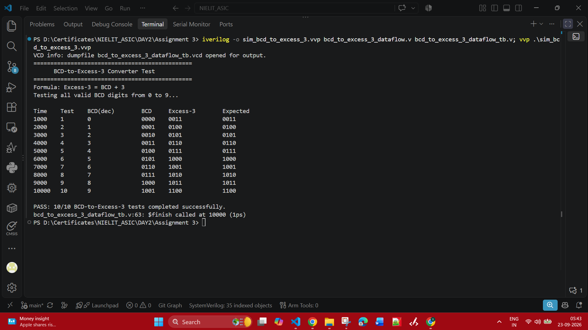
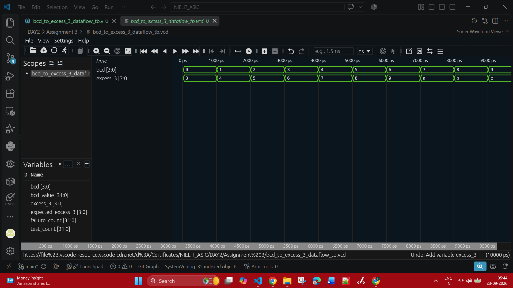
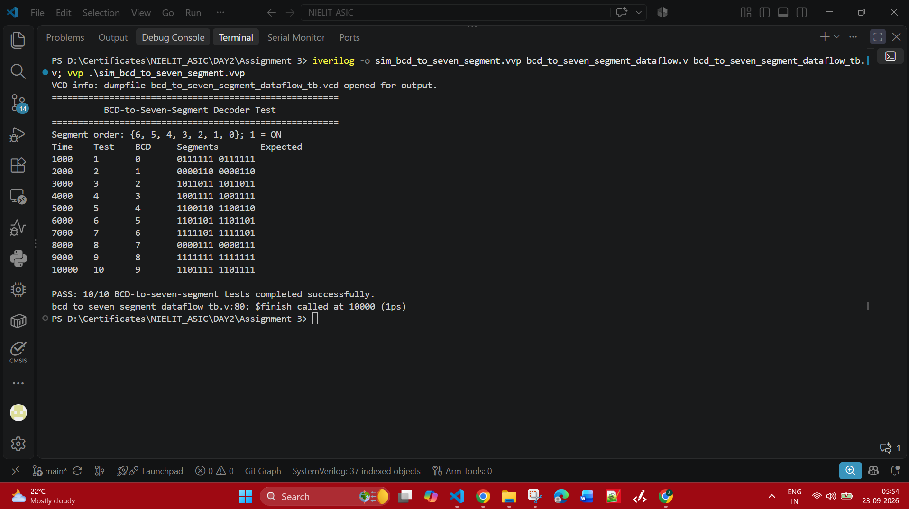
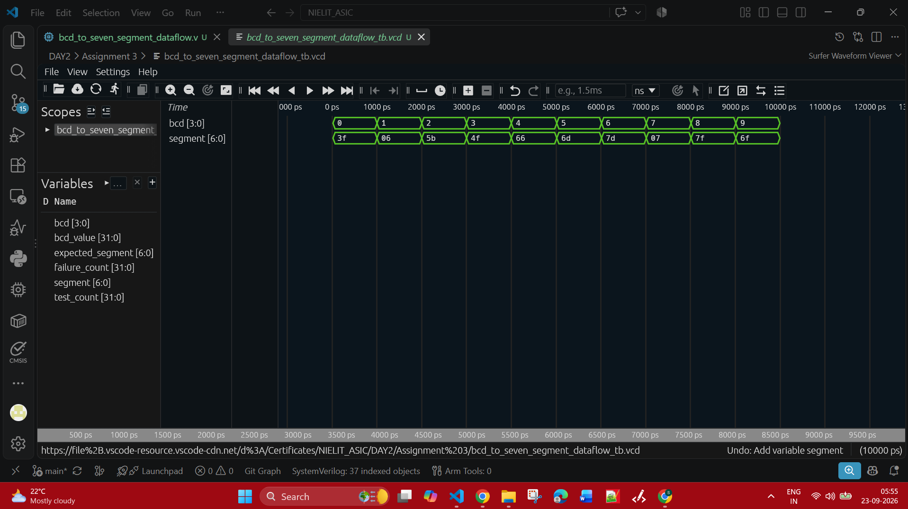

# Assignment 3 - BCD Code Converters

This assignment contains two combinational Verilog designs:

1. A 4-bit BCD-to-Excess-3 converter.
2. A 4-bit BCD-to-seven-segment display decoder.

## Assignment Files

| File | Purpose |
|---|---|
| [Assignment_questions_03.pdf](Assignment_questions_03.pdf) | Assignment problem statement |
| [bcd_to_excess_3_dataflow.v](bcd_to_excess_3_dataflow.v) | BCD-to-Excess-3 design |
| [bcd_to_excess_3_dataflow_tb.v](bcd_to_excess_3_dataflow_tb.v) | BCD-to-Excess-3 self-checking testbench |
| [bcd_to_seven_segment_dataflow.v](bcd_to_seven_segment_dataflow.v) | BCD-to-seven-segment design |
| [bcd_to_seven_segment_dataflow_tb.v](bcd_to_seven_segment_dataflow_tb.v) | BCD-to-seven-segment self-checking testbench |
| [bcd_to_excess_3_dataflow_tb.vcd](bcd_to_excess_3_dataflow_tb.vcd) | Excess-3 waveform data |
| [bcd_to_seven_segment_dataflow_tb.vcd](bcd_to_seven_segment_dataflow_tb.vcd) | Seven-segment waveform data |

## BCD to Excess-3

The BCD-to-Excess-3 converter adds binary `3` to every valid BCD input.

```text
BCD input       Excess-3 output
0000 (0)   + 3  0011 (3)
0001 (1)   + 3  0100 (4)
...              ...
1001 (9)   + 3  1100 (12)
```

### Simulation Evidence

The testbench applies all valid BCD inputs from `0` to `9` and reports `PASS: 10/10`.





## Seven-Segment Display

### Display Layout

```text
       ---
      |   |
      |   |
       ---
      |   |
      |   |
       ---
```

### Segment Numbering Used in the Verilog Module

```text
       --- 0 ---
      |         |
    5 |         | 1
      |--- 6 ---|
      |         |
    4 |         | 2
      |--- 3 ---|
```

The output is `segment[6:0]`. A segment bit of `1` turns that segment ON.

```text
segment[0] = top
segment[1] = upper-right
segment[2] = lower-right
segment[3] = bottom
segment[4] = lower-left
segment[5] = upper-left
segment[6] = middle
```

### BCD-to-Seven-Segment Conversion

The decoder reads the four-bit BCD input and uses a `case` statement to select the required segments. The bit pattern below is written as `{segment[6], segment[5], ..., segment[0]}`.

| Decimal digit | BCD input | Segments ON | `segment[6:0]` |
|---|---|---|---|
| 0 | `0000` | 0, 1, 2, 3, 4, 5 | `0111111` |
| 1 | `0001` | 1, 2 | `0000110` |
| 2 | `0010` | 0, 1, 3, 4, 6 | `1011011` |
| 3 | `0011` | 0, 1, 2, 3, 6 | `1001111` |
| 4 | `0100` | 1, 2, 5, 6 | `1100110` |
| 5 | `0101` | 0, 2, 3, 5, 6 | `1101101` |
| 6 | `0110` | 0, 2, 3, 4, 5, 6 | `1111101` |
| 7 | `0111` | 0, 1, 2 | `0000111` |
| 8 | `1000` | 0, 1, 2, 3, 4, 5, 6 | `1111111` |
| 9 | `1001` | 0, 1, 2, 3, 5, 6 | `1101111` |

Inputs from `1010` to `1111` are invalid BCD values, so the decoder turns every segment OFF (`0000000`).

### Simulation Evidence

The testbench verifies every valid BCD digit and reports `PASS: 10/10`.





## Compile and Simulate

### BCD-to-Excess-3

```powershell
iverilog -o sim_bcd_to_excess_3.vvp bcd_to_excess_3_dataflow.v bcd_to_excess_3_dataflow_tb.v
vvp .\sim_bcd_to_excess_3.vvp
gtkwave .\bcd_to_excess_3_dataflow_tb.vcd
```

### BCD-to-Seven-Segment

```powershell
iverilog -o sim_bcd_to_seven_segment.vvp bcd_to_seven_segment_dataflow.v bcd_to_seven_segment_dataflow_tb.v
vvp .\sim_bcd_to_seven_segment.vvp
gtkwave .\bcd_to_seven_segment_dataflow_tb.vcd
```
