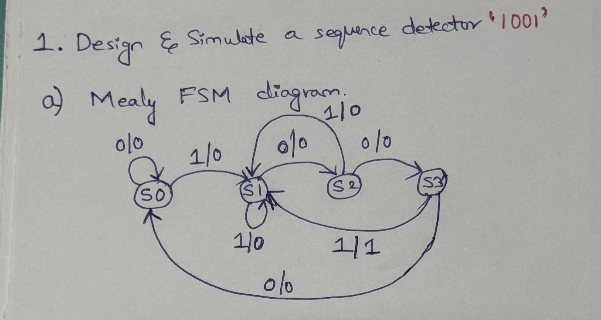
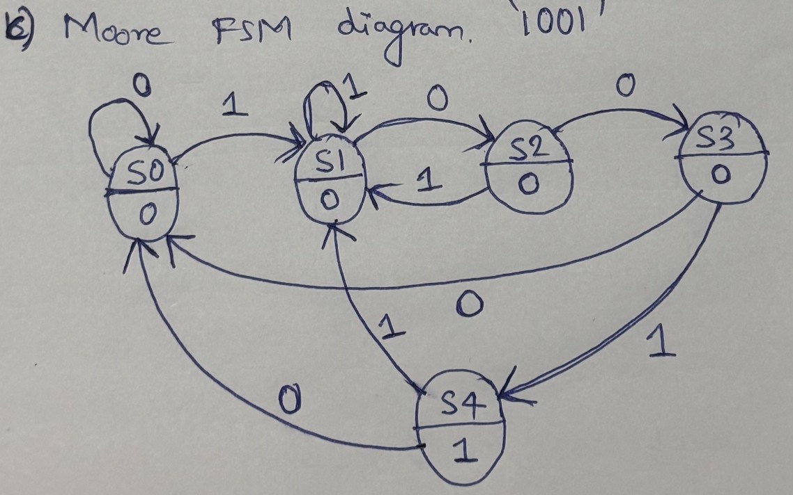
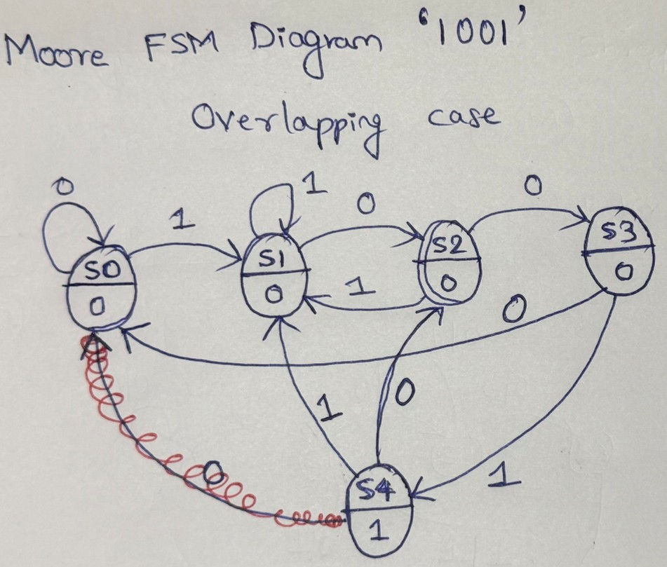

# Assignment 6: Sequence Detector for `1001`

## Objective

Design and simulate finite-state machines (FSMs) that detect the binary sequence `1001`.
This assignment implements three versions:

1. Mealy FSM sequence detector
2. Moore FSM sequence detector without overlap
3. Moore FSM sequence detector with overlap

The input is `data_in`, the detector is driven by `clk`, and `reset` initializes the FSM to the idle state. The output `detected` indicates that the sequence has been recognized.

## FSM Basics

A finite-state machine is a sequential circuit that moves between a fixed number of states according to the current state and the input.

The main parts of these designs are:

- **Present state (`PS`)**: The state stored in the state register.
- **Next state (`NS`)**: The state selected by the transition logic.
- **Clock (`clk`)**: The state changes on the rising edge of the clock.
- **Reset (`reset`)**: A synchronous active-high reset returns the FSM to `S0` on the rising clock edge.
- **Input (`data_in`)**: The serial input bit examined by the detector.
- **Output (`detected`)**: Indicates whether `1001` has been detected.

The RTL uses separate blocks for:

```verilog
always @(posedge clk)
```

This block stores the state, while the combinational blocks calculate `NS` and `detected`.

## Mealy FSM

In a Mealy machine, the output depends on both the present state and the current input:

```text
output = f(PS, data_in)
```

The output becomes `1` during the transition from `S3` when the current input is `1`. Therefore, the output is asserted on the same clock cycle in which the final bit of `1001` is received.

### Mealy states

| State | Meaning |
|---|---|
| `S0` | No matching prefix has been received |
| `S1` | The last bit was `1` |
| `S2` | The last two bits were `10` |
| `S3` | The last three bits were `100` |

### Mealy transition table

| Present state | Input `0` | Input `1` | Output condition |
|---|---|---|---|
| `S0` | `S0` | `S1` | `0` |
| `S1` | `S2` | `S1` | `0` |
| `S2` | `S3` | `S1` | `0` |
| `S3` | `S0` | `S1` | `1` on input `1` |

Source file: [`mealy_fsm_detect_1001.v`](mealy_fsm_detect_1001.v)

Testbench: [`mealy_fsm_detect_1001_tb.v`](mealy_fsm_detect_1001_tb.v)

## Moore FSM

In a Moore machine, the output depends only on the present state:

```text
output = f(PS)
```

A separate state, `S4`, represents successful detection. The output is `1` whenever the FSM is in `S4`.

### Moore states

| State | Meaning | Output |
|---|---|---:|
| `S0` | No matching prefix | `0` |
| `S1` | The last bit was `1` | `0` |
| `S2` | The last two bits were `10` | `0` |
| `S3` | The last three bits were `100` | `0` |
| `S4` | The complete sequence `1001` was detected | `1` |

### Non-overlapping Moore detector

After reaching `S4`, the FSM does not preserve the completed match as an overlapping prefix. Input `0` returns to `S0`, while input `1` goes to `S1` because that input can begin a new sequence.

| Present state | Input `0` | Input `1` |
|---|---|---|
| `S0` | `S0` | `S1` |
| `S1` | `S2` | `S1` |
| `S2` | `S3` | `S1` |
| `S3` | `S0` | `S4` |
| `S4` | `S0` | `S1` |

Source file: [`moore_fsm_detect_1001_nonoverlap.v`](moore_fsm_detect_1001_nonoverlap.v)

Testbench: [`moore_fsm_detect_1001_nonoverlap_tb.v`](moore_fsm_detect_1001_nonoverlap_tb.v)

### Overlapping Moore detector

The overlapping version preserves useful suffix information after a detection. In particular, after `S4`:

- Input `0` goes to `S2`, because the suffix `10` can begin another `1001`.
- Input `1` goes to `S1`, because the suffix `1` can begin another `1001`.

| Present state | Input `0` | Input `1` |
|---|---|---|
| `S0` | `S0` | `S1` |
| `S1` | `S2` | `S1` |
| `S2` | `S1` | `S3` |
| `S3` | `S0` | `S4` |
| `S4` | `S2` | `S1` |

Source file: [`moore_fsm_detect_1001_overlap.v`](moore_fsm_detect_1001_overlap.v)

Testbench: [`moore_fsm_detect_1001_overlap_tb.v`](moore_fsm_detect_1001_overlap_tb.v)

## Mealy and Moore Comparison

| Feature | Mealy FSM | Moore FSM |
|---|---|---|
| Output depends on | Present state and input | Present state only |
| Number of states | Usually fewer | Often requires an additional output state |
| Detection timing | Can assert during the transition | Asserts after entering the detection state |
| Output stability | Can change when the input changes | Changes only when the state changes |
| This assignment | Four states | Five states, including `S4` |

## Diagram Images

The handwritten FSM diagrams for this assignment are included below.

### Mealy FSM



### Moore FSM Without Overlap



### Moore FSM With Overlap



## Running the Simulations

The simulations use Icarus Verilog. Open a terminal in this directory and run:

```powershell
iverilog -g2012 -o mealy_fsm_detect_1001_tb.vvp mealy_fsm_detect_1001.v mealy_fsm_detect_1001_tb.v
vvp mealy_fsm_detect_1001_tb.vvp
```

For the non-overlapping Moore detector:

```powershell
iverilog -g2012 -o moore_fsm_detect_1001_nonoverlap_tb.vvp moore_fsm_detect_1001_nonoverlap.v moore_fsm_detect_1001_nonoverlap_tb.v
vvp moore_fsm_detect_1001_nonoverlap_tb.vvp
```

A waveform file can be viewed using a waveform viewer such as GTKWave when the testbench creates a `.vcd` file.

## Compilation and Simulation Logs

The latest randomized test runs produced these logs:

| Design | Compilation log | Simulation log |
|---|---|---|
| Mealy | [`mealy_fsm_detect_1001_compile.log`](mealy_fsm_detect_1001_compile.log) | [`mealy_fsm_detect_1001_simulation.log`](mealy_fsm_detect_1001_simulation.log) |
| Moore without overlap | [`moore_fsm_detect_1001_nonoverlap_compile.log`](moore_fsm_detect_1001_nonoverlap_compile.log) | [`moore_fsm_detect_1001_nonoverlap_simulation.log`](moore_fsm_detect_1001_nonoverlap_simulation.log) |
| Moore with overlap | [`moore_fsm_detect_1001_overlap_compile.log`](moore_fsm_detect_1001_overlap_compile.log) | [`moore_fsm_detect_1001_overlap_simulation.log`](moore_fsm_detect_1001_overlap_simulation.log) |

## Expected Behavior

For the input stream:

```text
1 0 0 1
```

the detector recognizes `1001` and asserts `detected`.

For overlapping detection, the suffix of a detected sequence is retained when it can be reused. For example, a stream containing repeated or partially shared occurrences of `1001` can produce multiple detections without returning unnecessarily to the idle state.

## Conclusion

This assignment demonstrates the difference between Mealy and Moore FSMs and shows how the transition table changes when overlapping sequence detection is required. The `PS` register stores the current state, the `NS` logic uses the input to calculate the next state, and the output logic follows either the Mealy or Moore definition.
